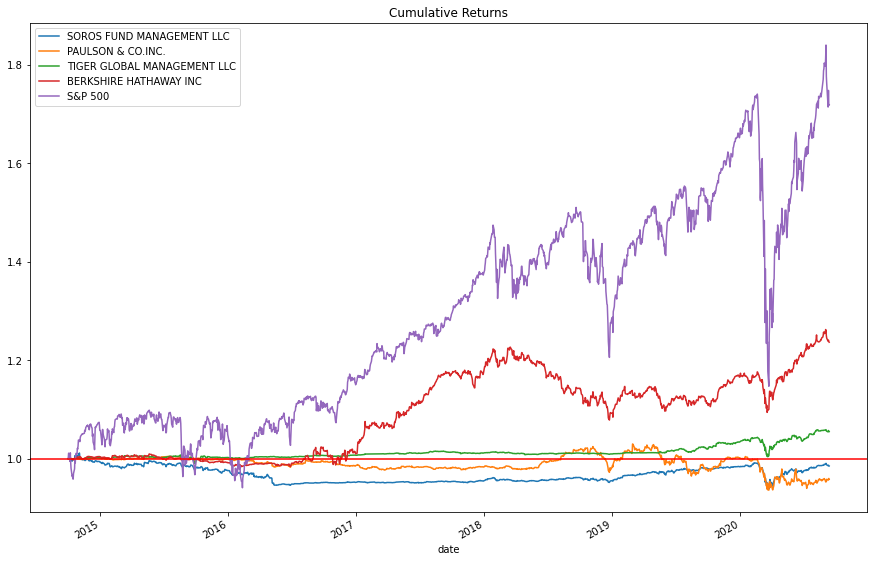
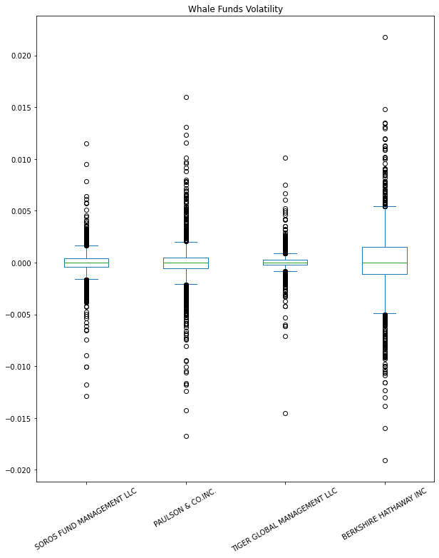
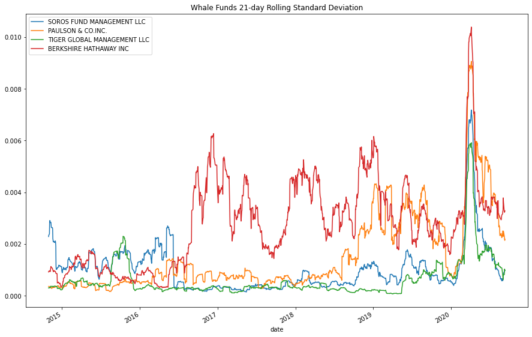
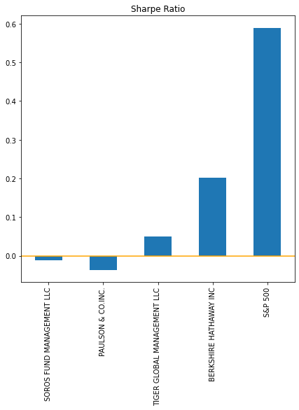

# module_4_challenge

`risk_return_analysis.ipynb` includes all the data handling, visualization, and final analysis.

---

## Datasets

Under [Resources Folder](Resources/), there is a dataset named `whale_navs.csv`.

The dataset includes prices of four hedge fund's portfolio and the S&P500's price from 2014-10-01 to 2022-09-11

---

## Technologies

**Programming language**

`python 3.7` or later

**Libraries used in the analysis**

`pandas` to handle and visualize the dataset

`pathlib` to access the dataset

`numpy` to simplify calculation

---

## Analysis

I would recommend Berkshire Hathaway's portfolio for inclusion in a firm’s suite of fund offering.

Reason 1:

Berkshire Hathaway's portfolio has about 23.7% of total return in 7 years, which is about 4 times more than the Tiger Global Management's portfolio *(Which is about 5.5% return)*

Reason 2:

After 2019, both portfolio has similar standard deviation (volatility). Berkshire Hathaway still has a little higher standard deviation, but compared to the market, the difference is minimal.

Reason 3:

Berkshire Hathaway's portfolio has higher sharpe ratio as well. That indicates it has better risk-return ratio, so taking the risk from the slight higher volatility would turn out better return.

---

## Contributors

Yu Takahashi
Email: yu.taka.070202@outlook.com

---

## License

Contact Yu Takahashi via the Email address above